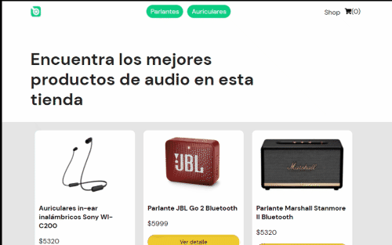

# Ecommerce Shop Audio

Este proyecto es un ecommerce con funcionalidad de catálogo y carrito. El proyecto es para cumplimentar el curso de React JS en Coderhouse.

## Dependencias

Se requiere instalar `json-server` para simular una API REST y buscar los productos del catálogo:

[https://github.com/typicode/json-server]

### `npm run server`

Después de instalar las dependencias se va a simular un server en el puerto 3001 para los productos:
[http://localhost:3001/productos] 

### `npm start`

Corre el comando para poder iniciar el proyecto y levantar un server de prueba:
[http://localhost:3000]

### Navegabilidad

