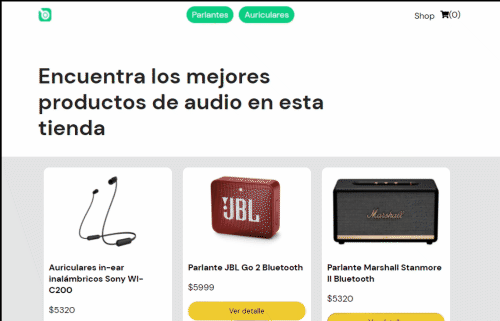

# Ecommerce Shop Audio

Este proyecto es un ecommerce con funcionalidad de catálogo con Firebase y carrito. El proyecto es para cumplimentar el curso de React JS en Coderhouse.

## Después de clonar

Para poder correr el proyecto correctamente, ejecutar desde consola lo siguiente: 

### `npm install`

Debés configurar un archivo '.env' dentro del directorio raíz con las siguientes variables de entorno para Firebase:

### `REACT_APP_API_KEY="your firebase data"`
### `REACT_APP_AUTH_DOMAIN="your firebase data"`
### `REACT_APP_PROJECT_ID="your firebase data"`
### `REACT_APP_STORAGE_BUCKET="your firebase data"`
### `REACT_APP_MESSAGE_SENDER_ID="your firebase data"`
### `REACT_APP_APP_ID="your firebase data"`

Luego, ya puedes inicializar el proyecto: 

### `npm start`

### Navegabilidad

